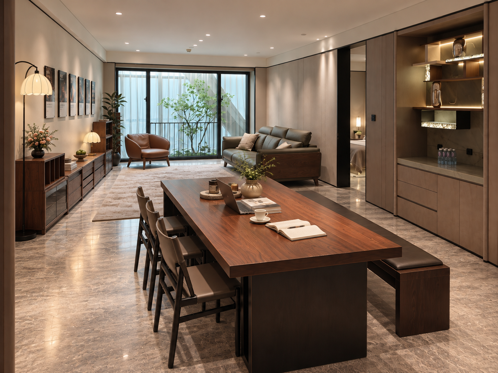
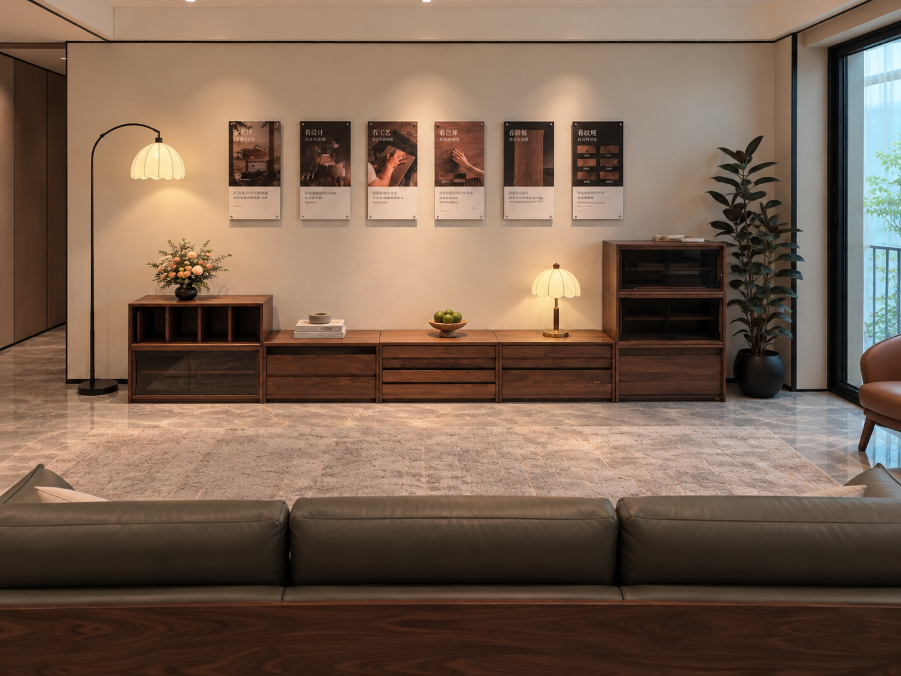

# 指定家具试摆 · v02

2026-10-08 · 按用户标注修订 · AI 实拍合成预览 · 用户已确认 AI 外观；真实模型另行复核

## 餐客厅整体

- 沙发沿一侧长墙摆放，正面朝向对面的模块柜；两者长向平行。
- 柜体保留参考的高低组合：一端开放格叠玻璃模块、中段低抽屉柜、另一端较高的叠放玻璃模块。
- 多功能桌兼顾吃饭、学习和办公，按用户要求保留原参考的红褐厚木桌面与深色板式底座；本轮以 2.6 m 长度作视觉试摆。
- 一侧为独立椅子，另一侧为一张长条凳。图中桌面留出读写与电脑使用空间。
- 保留原样板间石纹地面、墙顶、门窗和固定展示柜的环境表达，客厅无电视及茶几。

## 面向柜墙的近景

前景改为沙发的长背面和三段头枕背部，朝向对面柜墙，修正 v01 的前景沙发朝向。沿用用户认可的柜体与墙面陈设外观。

## 尺寸与版本边界

用户明确桌长在 2.5 m 以上；2.6 m 是这轮预览假设，尚非选定产品的实测尺寸。桌宽、长凳长度、柜体模块及现场通道均未获实测核验。图像的透视和物体尺度不能代替尺寸检查。

相对关系依据[试摆示意图](layout-v02.png)，该图只指导家具朝向及椅凳关系，不能作为建筑尺寸源。该记录为预览阶段；随后已获用户确认并应用到 metric-v07。桌子由最新 2.8 m 尺寸图覆盖 2.6 m 预览假设，当前实施见[迭代上下文](../../../docs/design/living-v02/DECISION.md)。

保留[v01 历史预览](REVIEW.md)。完整实际提示词见[整体图提示](dining-living-v02-prompt.txt)和[近景提示](cabinet-wall-v02-prompt.txt)；来源、哈希、尺寸假设与检查见[生成记录](generation-record-v02.json)。
