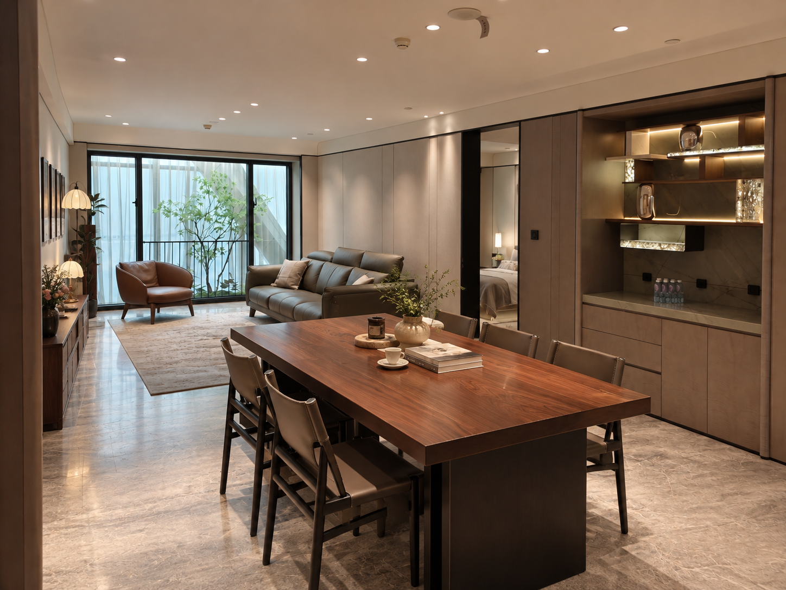
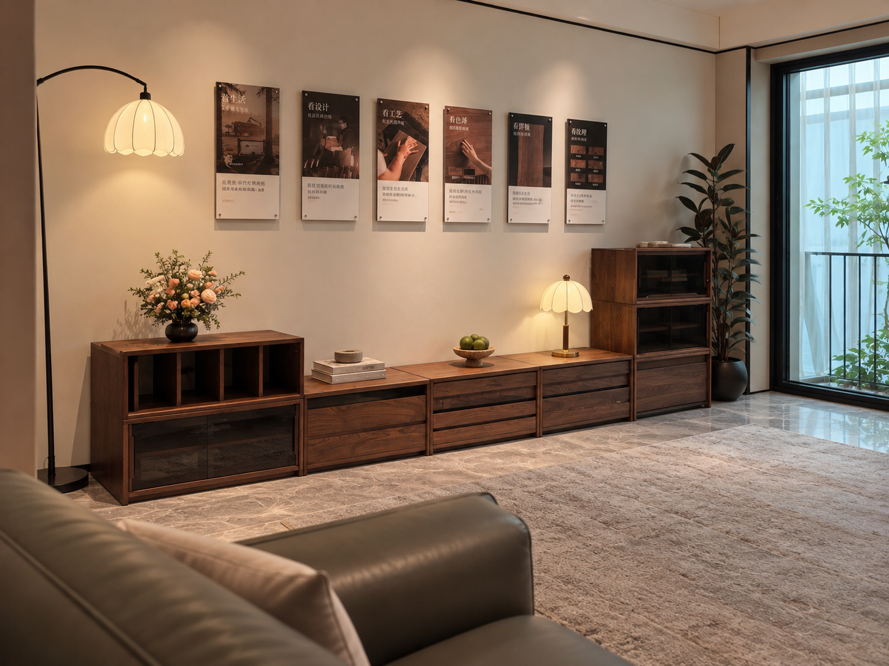

# 指定家具试摆 · v01

2026-10-08 · AI 实拍合成预览 · 待用户视觉反馈

本页保留 v01 历史候选。用户随后指出近景沙发朝向、整体图柜体高度和桌子规格/坐席问题，当前修订见[v02](REVIEW-v02.md)；柜墙近景的柜体及墙面外观获得认可，该认可不包含原图的沙发位置。

## 餐客厅整体

中段放入用户图1的厚木面餐桌及配套餐椅；南侧长墙放入图3的灰橄榄色皮沙发，窗边保留一张阅读椅。图2的柜墙在沙发对面。客厅中央不设置茶几。

## 柜墙近景

展示图2的深木色模块柜、高低错落组合、六幅竖向墙面图板、弧形落地灯及柜上花瓣罩台灯。该视角根据整体图、实拍及户型关系合成。

## 参考与边界

- [图1：餐桌](../../revisions/living-furniture-20261008/01-dining-table.png)。
- [图2：柜子与墙面布置](../../revisions/living-furniture-20261008/02-cabinet-wall.jpg)。
- [图3：沙发](../../revisions/living-furniture-20261008/03-sofa.jpg)。
- [样板间环境实拍](../../02-entry-living.jpg)、[户型图](../../01-floor-plan.png)。
- 使用内置 image_gen，提示摘要见 [prompt-summary.md](prompt-summary.md)，来源、哈希与检查见 [generation-record.json](generation-record.json)。
- 整体图以样板间实拍作为环境依据，保留灰色石纹地面、暖色墙顶、黑框南窗及原有灯带展示柜；家具材质随同一环境光合成。
- 图像是 AI 试摆预览，不能认定为已经匹配实测尺寸或完成 Blender 渲染。实际家具长宽、柜体模块尺寸、门口与通行距离尚未提供和验证，局部几何、纹理、颜色及补充视角可能存在生成偏差。
- 当前模型、网页和发布清单没有应用这组家具；这些图片仅用于本轮讨论，尚未发布。
